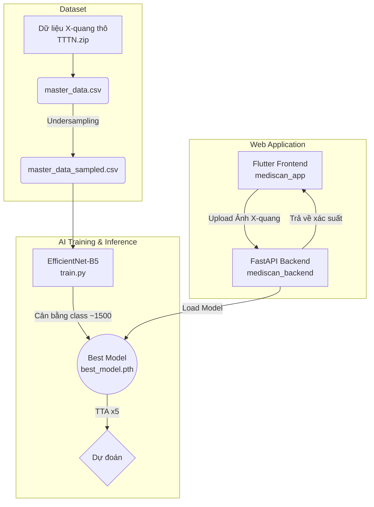
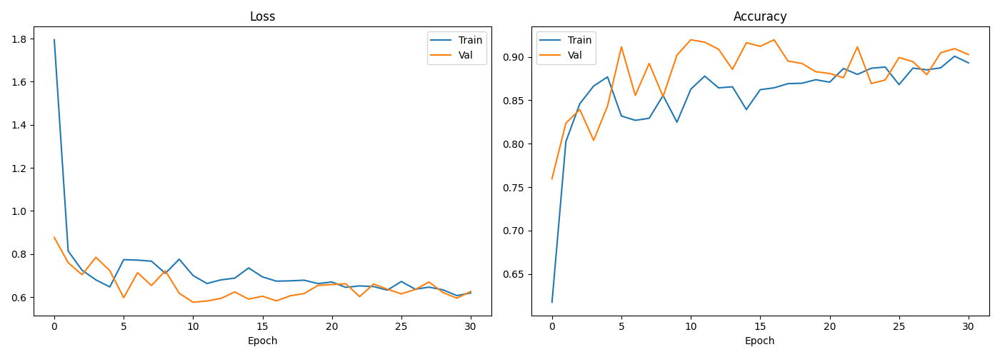
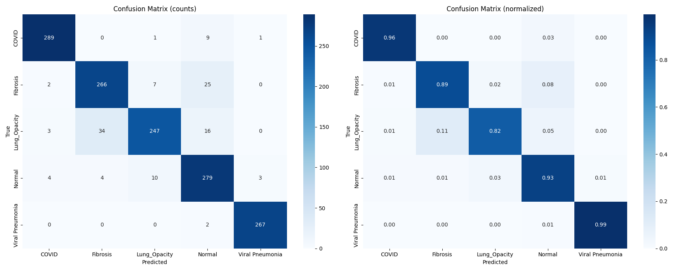

# MediScan AI 🫁 - Phân tích X-Quang Ngực

MediScan AI là một hệ thống toàn diện giúp hỗ trợ chẩn đoán 5 loại bệnh lý và trạng thái qua ảnh X-quang ngực (COVID-19, Fibrosis, Lung Opacity, Normal, Viral Pneumonia). 

Hệ thống bao gồm:
- **Mô hình AI**: Sử dụng kiến trúc EfficientNet-B5 với kỹ thuật Test-Time Augmentation (TTA), đạt độ chính xác **91.76%**.
- **Backend API**: Xây dựng bằng FastAPI, cho phép xử lý ảnh và trả về kết quả dự đoán với tốc độ cao.
- **Frontend App**: Giao diện đa nền tảng, trực quan được xây dựng bằng Flutter.

## 🌟 Sơ đồ Kiến trúc (Pipeline Diagram)

## 🚀 Khả năng của Hệ thống
- **Chẩn đoán đa lớp**: Hỗ trợ phân loại 5 lớp bệnh lý/trạng thái với độ chính xác và độ tin cậy cao.
- **Cân bằng dữ liệu (Data Balancing)**: Xử lý tình trạng mất cân bằng dữ liệu bằng cách giới hạn tối đa 1500 mẫu cho mỗi lớp, đảm bảo mô hình không bị thiên vị (bias) vào bất kỳ lớp nào.
- **Độ tin cậy vượt trội**: Sử dụng kỹ thuật Test-Time Augmentation (TTA) với 5 phép biến đổi ảnh khác nhau khi dự đoán thực tế (inference) để đưa ra kết quả trung bình ổn định nhất.
- **Triển khai cực kỳ nhanh chóng**: Chỉ với 2 file batch (`.bat`), toàn bộ hệ thống (gồm cả API backend và giao diện web) sẽ sẵn sàng hoạt động ngay lập tức.

## 📂 Cấu trúc Repository

Mã nguồn và dữ liệu đã được tối ưu và đóng gói hoàn chỉnh:

- `train.py`: (Trước đây là `kaggle.py`) Script huấn luyện mô hình bao gồm training pipeline, xử lý dữ liệu và đánh giá.
- `mediscan_backend/`: Thư mục chứa API server viết bằng Python / FastAPI (`main.py`, `model.py`).
- `mediscan_app/`: Thư mục chứa ứng dụng web giao diện người dùng viết bằng Flutter.
- `start_backend.bat` & `start_frontend.bat`: Các script tiện ích để khởi động một chạm hệ thống trên môi trường Windows.
- `result/`: Thư mục chứa các kết quả đánh giá (Confusion Matrix, Training Curves, Classification Report) và trọng số của mô hình tốt nhất (`best_model.pth`).
- **Dữ liệu**: Bộ dataset gốc được lưu trong file `TTTN.zip`.
- `master_data.csv`: File chứa thông tin toàn bộ dữ liệu gốc.
- `master_data_sampled.csv`: File dữ liệu **rút gọn để cân bằng**, đã trải qua quá trình undersampling giới hạn 1500 mẫu mỗi lớp, giúp đảm bảo quá trình training diễn ra công bằng và ổn định.

## 📊 Trực quan hóa Kết quả (Model Performance)

Mô hình đã đạt độ chính xác ấn tượng **91.76%** trên tập validation với các báo cáo cụ thể:

### Biểu đồ Huấn luyện (Loss & Accuracy)
Biểu đồ cho thấy mô hình hội tụ tốt, không có hiện tượng overfitting rõ rệt nhờ vào các chiến lược điều chuẩn (regularization) và warmup cosine.

### Ma trận Nhầm lẫn (Confusion Matrix)
Ma trận phân loại các lớp một cách ổn định, khả năng nhận diện COVID-19 và Viral Pneumonia gần như hoàn hảo.

## 🛠 Hướng dẫn Sử dụng

1. **Khởi động API Backend**:
   Click đúp chạy file `start_backend.bat`. Backend sẽ khởi tạo model và lắng nghe các request tại `http://localhost:8000`.
   *(Yêu cầu có cài đặt Python, môi trường sẽ tự động cài các thư viện trong requirements.txt)*
   
2. **Khởi động Web Frontend**:
   Click đúp chạy file `start_frontend.bat`. Giao diện Web sẽ tự động build và mở trên trình duyệt tại `http://localhost:3000`.
   *(Yêu cầu môi trường đã cài đặt sẵn Flutter)*
